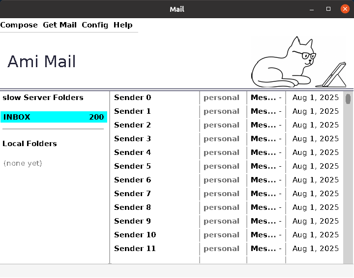
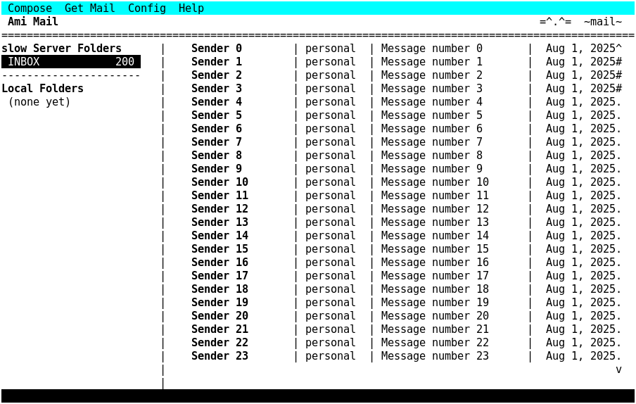
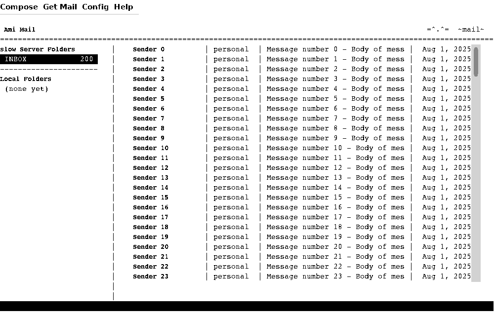

# Ami !

**One program source, presented wherever you run it.** The same
"hello, world" -- the standard C program, unchanged -- on a command
line, on a terminal, and in a graphical window:

| Command line | Terminal | Graphical |
|:---:|:---:|:---:|
|  |  |  |

And the same idea carried to a full application. This is one mail
client -- one core holding the store, the fetch engine and the
protocols -- with front ends that differ only in how they draw. In
pixels; in character cells on a stock terminal, windows and widgets
managed by Ami's own character-mode window manager; and the character
front end linked against the graphical library, which speaks the whole
terminal API onto a window of its own:

**mail** -- the graphical front end:

**mailc** -- the same mail in character cells, running in a plain
terminal, with menus, windows and widgets from the character-mode
window manager:

**mailcg** -- the character front end, unchanged, compiled against the
graphical library:

And the whole of it in motion. Breakout, run eight ways: in characters
and in pixels, on this machine, over ssh, over Ami's own remote display
protocol, over waypipe, and on Mac OS X and Windows -- the same program
each time. 

https://github.com/user-attachments/assets/5204f94b-4840-4060-a838-fe2f6590f905

Note that not all transports carry sound, so some of the demos in the video
do not carry sound. Note however that the Ami remote transport does carry
sound ! In fact it is the only transport out of Wayland, X11 and WayPipe that does.

Click to play on Youtube:

---

The AMI tk is a toolkit based on the idea that carefully crafted display
paradigms can carry forward. Ami starts with the serial display paradigm
and carries that into a terminal oriented paradigm, then to a fully
graphical and windowed paradigm.

Web page for Ami !

https://samiam95124.github.io/amitk

To fetch and build it (the tree carries submodules, so take them along):

    git clone --recurse-submodules https://github.com/samiam95124/amitk.git
    cd amitk
    . setpath
    ./configure
    make

The full procedure, including what to do when the glibc override does
not match your system, is in [INSTALL](INSTALL).

Please see the following documents to get started in Petit-Ami

    doc/petit_ami.docx  The "grand unified" document of what it is, how to
                        install it, etc.
    INSTALL             The basic install procedure.

The project is presented as complete within a single tree. The format is
along the lines of GNU projects, IE, with a configure, Makefile, README, etc.
